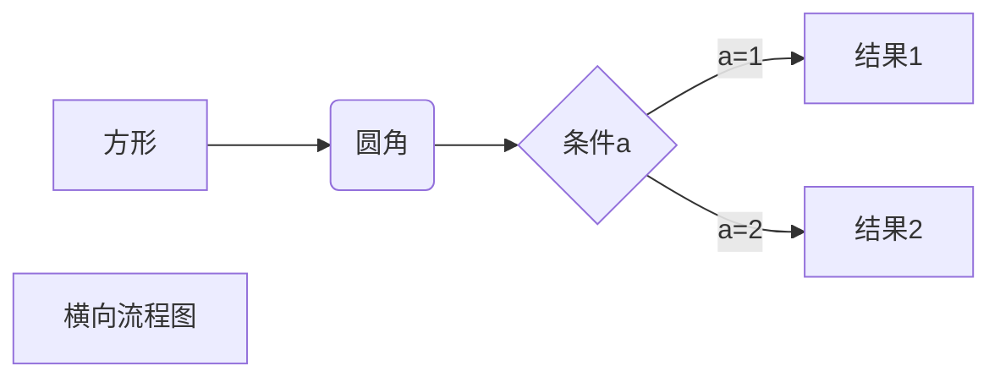
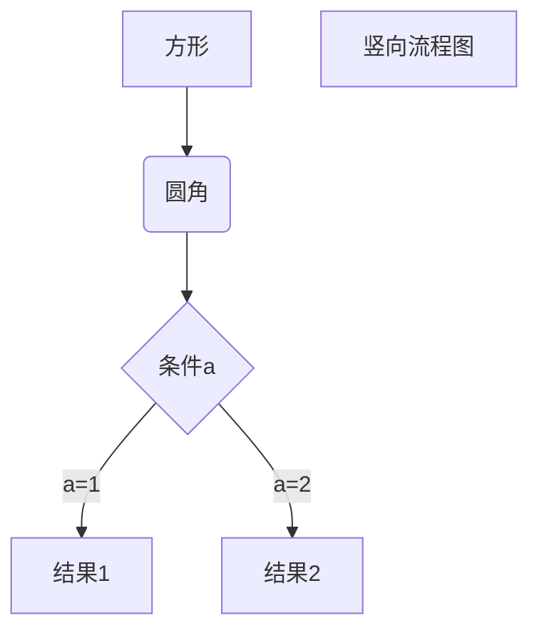

# hello world
<https://www.runoob.com/markdown/md-tutorial.html>

## 标题
1.使用=和-表示一二级标题  
2.用#标记，1-6个

## 段落
1.段落换行：两个空格+回车或空一行重开一个段落  
2.字体 (*和_等效) 
*斜体*  _哈哈_
**粗体** ***粗斜体***  
3.分割线（3个及以上的*或-） 
***
---
4.删除线 ~~哈哈~~  
5.下划线（后一个取消） <u>哈哈</u>  
6.脚注（有点问题）  

哈哈[^test]。  
[^test]: 哈哈  

## 列表
* 无序列表（-，+，*都可以）
1. 有序列表
    - 嵌套列表（四个空格）
        > 列表使用区块

## 区块
> 区块
>> 嵌套区块
>+ 区块内使用列表

## 代码
printf 函数 区别 `printf`函数  
``` javascript
$(document).ready(function () {
    alert('RUNOOB');
});
```

## 链接  
链接[百度](www.baidu.com)   
或者<https://www.baidu.com>  

高级链接    [Google][ok]  

[ok]: https://google.com/

## 图片
 

## 表格  
| 左对齐 | 右对齐   | 居中对齐 |
| :-----| ----: | :----: |
| 单元格 | 单元格 | 单元格 |
| 单元  | 单元  | 单元 |

## 公式(需要看LEX格式)
$$\begin{Bmatrix}
a & b \\
c & d
\end{Bmatrix}$$

# 画图
1.横向流程图


2.竖向流程图源码格式：



3.标准流程图源码格式：

```flow
st=>start: 开始框
op=>operation: 处理框
cond=>condition: 判断框(是或否?)
sub1=>subroutine: 子流程
io=>inputoutput: 输入输出框
e=>end: 结束框
st->op->cond
cond(yes)->io->e
cond(no)->sub1(right)->op
```

等等...